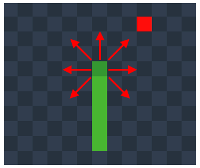
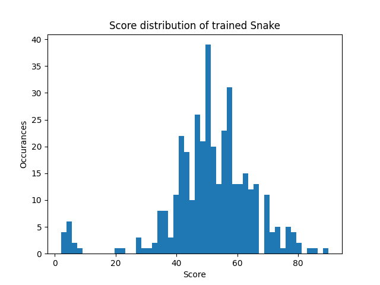

# Snake Game with Improved Deep Q Reinforcement Learning


*^This is a spoiler^*

## Overview

The Deep Q Network (DQN) predicts the Q value (the reward plus the sum of all discounted future rewards) for each possible action.

The DQN accepts a state of input data (length 9) from the game. The first 7 states are the normalised distances to the nearest non-empty blocks and are positive if the block is an apple and negative if the block is the snakes body or a wall. These states are normalised so that a larger distance results is a smaller value. The 7 directions are shown in Figure 1. The 8th state is the normalised angle to the food. The 9th state is the length of the snakes body with it aim that it's strategy will change as it gets longer. As the input state is relative to the snake's orientation, the possible actions should be too. Therefore the the DQN outputs Q values for 3 actions (left, forward and right).

Training uses improvements to basic DQN including epsilon-greedy, experience replay and a secondary target network for calculating loss.



*Figure 1*

## Challenges and Improvements

### Sparse Rewards
Sparse rewards is a common issue in reinforcement learning where the possible number of states is so large that during initial exploration (random movement) the agent doesn't encounter enough rewards to learn from. There were 2 improvements to overcome this:
1. Give the snake a small reward for taking a movement closer to the food. This works as the direction to the food is input to the DQN building a correlation between them. Note, punishing the snake for moving away from the food is a bad idea as it may encourage the snake to kill itself to maximise reward.
2. Limit the number of irrelevent experiences which get added to replay memory. I placed constraints on min and max % of food and death rewards in experience replay with a reduced probablity of adding to memory if the reward is not significant. This was needed for both food and death as early on food was sparse whereas later in training (see below) deaths were sparse.

### Catastrophic Forgetting
The main problem to overcome in this project was the phenomena of 'Catastrophic Forgetting'. This occurs during training when the agent has improved enough to grasp the basic rules of the game and therefore begins to achieve better scores. Therefore, the replay memory becomes populated with correct answers and overfits to this, causing it to forget the basic rules it learnt in the exploration phase. The result is a **decrease** in performance with **increasing** training.

To overcome this I have added the chance (once experience replay memory is full) to play a game with random actions to ensure some random failures exist in replay memory. Further, I added the chance for the agent to play a full game following the optimal policy (no random actions) for the agent to train on some states with greater snake length. Note, this is required as snake length is one of the state attributes.

## Results
The results for testing the snake agent over 377 games are shown below. The average score was 51.3



## How to run
To download the repository, open a cmd prompt and execute
```
git clone https://github.com/harry-crocker/Snake_DQN.git
```

This will create a folder on your computer that you can access from the command prompt by executing 

```
cd Snake_DQN
```

Create a virtual environment and activate it. For infos, click [here](https://packaging.python.org/guides/installing-using-pip-and-virtual-environments/).

Download the necessary libraries:

```
pip install -r requirements.txt
```

To run the snake with pre-trained DQN

```
python main.py
```

To terminate running, press Q on your keyboard

Alternatively use the below optional inputs to change the function
```
python main.py gamemode train reset_weights
```

Where 

gamemode:         0 = player input using arrow keys

                  1 = AI input from DQN
                  
train:            0 = don't train (DQN weights won't be changed)

                  1 = train snake
                  
reset_weight:     0 = Don't reset

                  1 = Reset weights to retrain
                  
Also, training can be toggled on/off at anytime by pressing 'T' on keyboard and display can be toggled with 'D' (to improve speed)

For example:
To play yourself, without AI 
```
python main.py 0 0 0
```
To retrain a new DQN and overwrite existing weights
```
python main.py 1 1 1
```
It is also suggested to press 'D' to toggle display off when training 

Periodically turn display on and train off (press 'D' and 'T') to test the current DQN

Intelligent behaviour can be seen after only a few minutes of training


